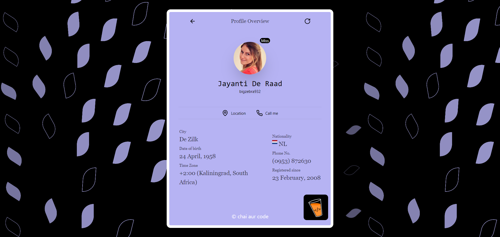

# [ReUseIt2](https://re-use-it-2.netlify.app/)

## `Build faster. Reuse more.`

**_MasterJi Machine Coding Round - 2 (React.js) Assignment_**

### [Component 1 : Random User Profile](https://re-use-it-2.netlify.app/random-user)

</img>

- Card Component that displays information of random user data fetched from api.
- This component is built using React and vanilla javascript.
- API used to get random user data : https://api.freeapi.app/api/v1/public/randomusers/user/random
- Package used to add map image support : `react-country-flag`
- Package used to add loading skeleton animation : `react-loading-skeleton`

### [Component 2 : Random Jokes tweet](https://re-use-it-2.netlify.app/random-jokes)

</img>

- Card Component that displays random joke data fetched from api as a tweet.
- Tweet author details are kept static.
- Timestamp, views, date & other analytics of tweet are randomly generated using a custom function.
- This component is built using React and vanilla javascript.
- API used to get random user data : https://api.freeapi.app/api/v1/public/randomjokes/joke/random
- Package used to add loading skeleton animation : `react-loading-skeleton`
